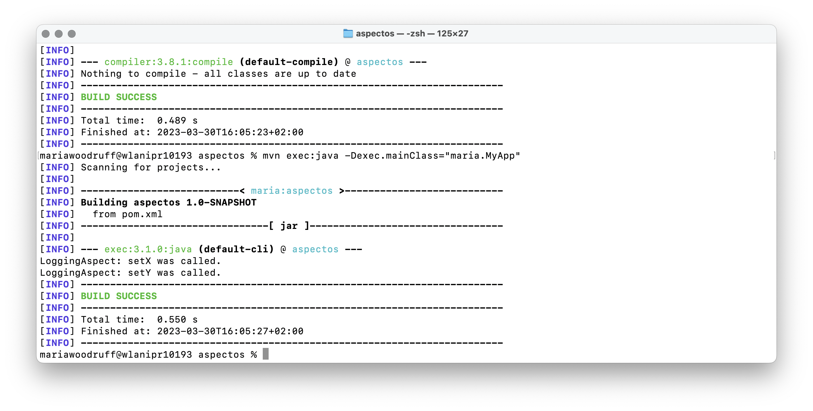

# Aspectos

Los aspectos en Java sirven para separar la aplicación de las preocupaciones tales como el registro, la seguridad o el control de errores. En vez de escribir el código de la preocupación transversal en varios lugares de la aplicación, se escribe un solo código que se llama aspecto y se aplica a varias partes de la aplicación.

La intercepción de métodos es una forma de implementar aspectos. Consiste en interceptar la llamada a un método antes o después de su ejecución, y realizar alguna acción adicional. En Java, esto se puede hacer utilizando bibliotecas de inyección de dependencias como Guice.

## Aspectos en Java usando intercepción de métodos con Guice

Para implementar un aspecto en Java con Guice, primero se debe definir el aspecto en una clase separada llamada interceptor y e implementarse la interfaz MethodInterceptor de la biblioteca de interceptación de Guice. Luego, se define una clase de módulo que registra la clase que se va a interceptar y el interceptor que se va a aplicar a ella.

Finalmente, se crea un objeto injector que crea y configura los objetos de la aplicación. Cuando se llama a un método en un objeto que se ha configurado con Guice, éste automáticamente aplica los interceptores especificados en el módulo correspondiente.

## Ejercicio Editor de Figuras

En el ejemplo, se define un aspecto LoggingAspect que intercepta la llamada a cualquier método en las clases Line y Point, y registra información de registro adicional. Luego, se define un módulo MyAppModule que registra las clases Line y Point y especifica que el interceptor LoggingAspect se debe aplicar a ellas. Finalmente, se crea un objeto injector que se utiliza para crear instancias de las clases Line y Point, y se llama a algunos métodos en ellas para demostrar el funcionamiento del interceptor.

### Interceptor.java

Primero creamos una interfaz de anotación personalizada que nos permita marcar los métodos que deseamos interceptar.

```java
@Target(ElementType.METHOD)
@Retention(RetentionPolicy.RUNTIME)
public @interface Interceptor {}
```

### LoggingAspect.java

Luego creamos una clase de aspecto que implemente el código de intercepción que queremos aplicar a los métodos marcados con la anotación "Interceptor". En este caso, vamos a imprimir una línea de registro cada vez que se llame a uno de los métodos "setP1", "setP2", "setX" o "setY".

Esta clase extiende la clase "AbstractModule" de Guice y utiliza el método "bindInterceptor" para registrar el código de intercepción. La primera llamada al método "Matchers.any()" especifica que cualquier clase puede ser interceptada, mientras que la segunda llamada al método "Matchers.annotatedWith(Interceptor.class)" especifica que solo se deben interceptar los métodos marcados con la anotación "Interceptor". El método de intercepción en sí imprime el nombre del método que se está llamando y luego llama al método "proceed()" para continuar con la ejecución normal del método.

```java
public class LoggingAspect implements MethodInterceptor {
 @Override 
  public Object invoke(MethodInvocation invocation) throws Throwable {
    String methodName = invocation.getMethod().getName();
    System.out.println("LoggingAspect: " + methodName + " was called.");
    return invocation.proceed();
  }
}

```

### MyAppModule.java

Para aplicar el aspecto creamos un módulo de Guice y registramos la clase "LoggingAspect" y las clases que deseamos interceptar ("Line" y "Point"). Llamamos al método "bind" para registrar las clases "Line" y "Point", y luego al método "bindInterceptor" para registrar la clase "LoggingAspect".

```java
public class MyAppModule extends AbstractModule {
  @Override
  protected void configure() {
    bind(Line.class);
    bind(Point.class);
    bindInterceptor(
      Matchers.any(),
      Matchers.annotatedWith(Interceptor.class),
      new LoggingAspect() // Aquí se usa la instancia de LoggingAspect
    );
  }
}
```

### MyApp.java

Creamos una instancia de la clase "Injector" de Guice y la usamos para obtener instancias de "Line" y "Point" con el aspecto de intercepción aplicado.

```java
public class MyApp {
  public static void main(String[] args) {
    Injector injector = Guice.createInjector(new MyAppModule());
    Line line = injector.getInstance(Line.class);
    Point point = injector.getInstance(Point.class);

    line.setP1(new Point());
    line.setP2(new Point());
    point.setX(10);
    point.setY(20);
  }
}
```

## Salida del programa

Compilar:
```console
javac MyApp.java MyAppModule.java Point.java Line.java Interceptor.java LoggingAspect.java
```

Ejecutar:
```console
java MyApp
```

Salida del programa:
```console
LoggingAspect: setP1 was called.
LoggingAspect: setP2 was called.
LoggingAspect: setX was called.
LoggingAspect: setY was called.
```

## Crear un proyecto Maven

Voy a la carpeta anotaciones y en la terminal escribo el siguiente comando. El group id es maria y el artifact id es aspectos.

```console
mvn archetype:generate -DgroupId=maria -DartifactId=aspectos -DarchetypeArtifactId=maven-archetype-quickstart -DinteractiveMode=false
```

Añado a pom.xml la dependencia de com.google.inject:guice sabiendo que la última versión es 5.1.0.

```pom.xml
<dependency>
  <groupId>com.google.inject</groupId>
  <artifactId>guice</artifactId>
  <version>5.1.0</version>
</dependency>
```
Para evitar errores además añadí:

```pom.xml
<dependency>
  <groupId>aopalliance</groupId>
  <artifactId>aopalliance</artifactId>
  <version>1.0</version>
  </dependency>
```

```pom.xml
<build>
  <plugins>
    <plugin>
      <groupId>org.apache.maven.plugins</groupId>
      <artifactId>maven-compiler-plugin</artifactId>
      <version>3.8.1</version>
      <configuration>
        <source>1.8</source>
        <target>1.8</target>
      </configuration>
    </plugin>
  </plugins>
</build>
```

Actualizo las dependencias del proyecto y en el mismo directorio donde está el archivo pom.xml escribo:

```console
mvn dependency:resolve
mvn clean install 
```

Compilo:

```console
mvn compile 
```

Ejecuto:

```console
mvn exec:java -Dexec.mainClass="maria.MyApp"
```

Compruebo que se ha ejecutado bien y que se imprime:
```console
LoggingAspect: setX was called.
LoggingAspect: setY was called.
```

